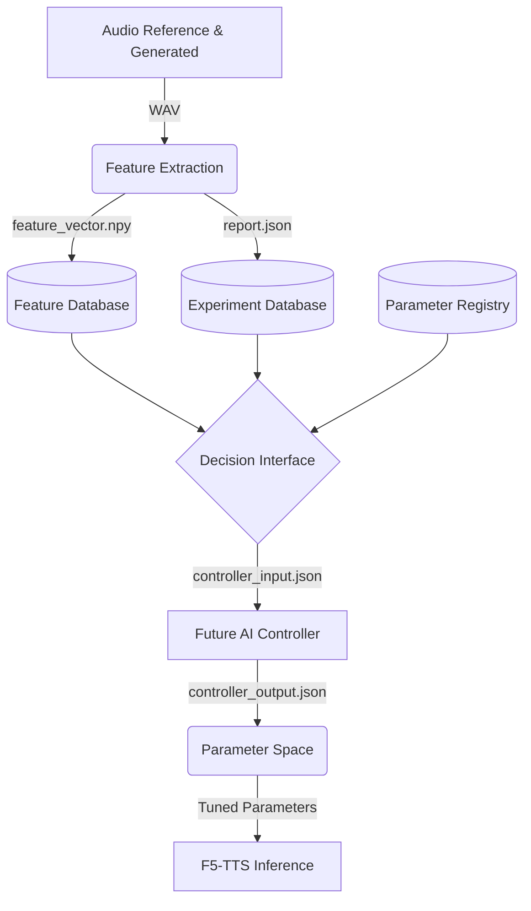
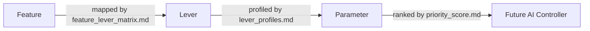

# TỔNG QUAN DỰ ÁN: F5-TTS EXPRESSIVE PERFORMANCE TRANSFER
*(Dự án AI Dubbing Tự động hóa cho Kênh YouTube)*

## 1. BỐI CẢNH VÀ VẤN ĐỀ NANG GIẢI
Hiện tại, quy trình lồng tiếng (Dubbing) video từ tiếng Trung sang tiếng Việt cho YouTube đối mặt với một nút thắt lớn:
- **TTS Truyền thống:** Giọng đọc quá đều đều, thiếu cảm xúc, không thể hiện được các sắc thái phức tạp (gào thét, khóc lóc, thì thầm) của diễn viên gốc.
- **Giải pháp Voice Cloning hiện tại (như F5-TTS zero-shot):** Mặc dù có khả năng bắt chước cảm xúc (Performance) rất tốt từ file âm thanh gốc, nhưng nó lại bắt chước luôn cả màu giọng (Timbre/Speaker Identity) của người gốc. Điều này phá vỡ tính nhất quán của kênh YouTube (kênh cần giữ một giọng lồng tiếng cố định).

## 2. MỤC TIÊU CỐT LÕI (NORTH STAR)
**Xây dựng một hệ thống AI Dubbing đáp ứng 3 tiêu chí:**
1. **Chất lượng:** Giữ nguyên được màu giọng (Timbre) tiếng Việt cố định của kênh, nhưng hấp thụ được 100% sắc thái diễn xuất (Pitch, Energy, Tempo) từ video gốc tiếng Trung.
2. **Kỹ thuật:** Không train lại model, không phụ thuộc API trả phí của bên thứ 3. Chỉ sử dụng kỹ thuật can thiệp vào quá trình Inference của mạng Nơ-ron.
3. **Thực dụng:** Tối ưu hóa để có thể chạy mượt mà trên phần cứng hạn chế (Google Colab T4 hoặc Laptop tầm trung), đảm bảo thời gian render (RTF) đủ nhanh để sản xuất video dài.

## 3. TRIẾT LÝ NGHIÊN CỨU (METHODOLOGY)
Dự án này đã được nâng cấp từ việc "hack mã nguồn cảm tính" lên tiêu chuẩn của một **Phòng Lab AI (Empirical R&D)** với các nguyên tắc thép:
- **Data-Driven (Nói chuyện bằng số liệu):** Mọi sự thay đổi mã nguồn phải được chứng minh bằng số liệu đo lường định lượng, không đoán mò (Black Box Approach).
- **The Weakest Link & Ablation Study:** Tìm ra khâu yếu nhất và chỉ thay đổi duy nhất một biến số (One variable at a time) trong mỗi lần thử nghiệm.
- **Tách biệt Ngữ nghĩa:**
  - *Observation (Quan sát):* Thu thập dữ liệu khách quan từ tool đo lường.
  - *Conclusion (Kết luận):* Chỉ đưa ra kết luận khi có đủ bằng chứng, loại trừ các sai số do đo lường (như khác biệt ngôn ngữ, căn chỉnh thời gian - alignment).
- **Phân tách 3 Tầng Thông tin (The 3 Layers):**
  1. *Linguistic Layer:* Văn bản (Tiếng Việt).
  2. *Performance Layer:* Diễn xuất (Cao độ, Cường độ, Nhịp điệu).
  3. *Speaker Layer:* Danh tính/Màu giọng (Timbre).

## 4. TIẾN ĐỘ HIỆN TẠI VÀ LỘ TRÌNH
Dự án được triển khai theo một Lộ trình (Roadmap) siêu chặt chẽ, hiện đang ở Giai đoạn 1.

### ✅ Những gì đã hoàn thành:
1. **Hoàn thiện Vi-F5-TTS Pipeline:** Chạy ổn định trên Colab, xử lý được Dynamic Speed và Smart Subtitle Timing (tránh đè giọng).
2. **Giai đoạn 1A - Xây dựng Benchmark Framework (`benchmark/`):**
   - Đã lập trình xong hệ thống chấm điểm tự động đo lường 4 trục cảm xúc: **Pitch (Cao độ), Energy (Độ to), Tempo (Tốc độ), Pause (Ngắt nghỉ).**
   - Áp dụng các thuật toán chuẩn như DTW (Dynamic Time Warping) để nắn chỉnh sự khác biệt thời gian giữa các ngôn ngữ.
3. **Giai đoạn 1B - Validate Benchmark:**
   - Hệ thống Benchmark đã vượt qua các bài kiểm tra Stress Test (Identity, Volume, Tempo, Noise). Đảm bảo công cụ đo lường không bị đánh lừa bởi các yếu tố nhiễu.

### 🚧 Đang thực hiện (Giai đoạn 2): Đo Baseline
Thu thập số liệu gốc trước khi can thiệp vào mã nguồn. 
- **Baseline A:** Test nội bộ tiếng Việt để xác định sai số của bản thân công cụ đo lường.
- **Baseline B:** Chạy 10 câu cảm xúc (Trung -> Việt) qua F5 mặc định để lấy điểm số nền tảng (Performance Transfer Score).

### 🚀 Lộ trình tiếp theo (Giai đoạn 3 & 4):
- Từ số liệu Baseline, xác định "Nút thắt" (Ví dụ: F5 rớt nhịp điệu hay F5 rớt màu giọng?).
- Đề xuất các điểm can thiệp (Levers) vào kiến trúc DiT (Diffusion Transformer) của F5.
- Thực thi thử nghiệm, đưa qua 3 Ải kiểm duyệt (Benchmark -> MOS Tai người -> Hiệu năng) trước khi chốt phương án cuối cùng.

## 5. KIẾN TRÚC HỆ THỐNG (STAGE 1.5 - AI CONTROLLER INFRASTRUCTURE)
Hệ thống hiện tại đã được nâng cấp thành một cơ sở hạ tầng Controller hoàn chỉnh, tách biệt hoàn toàn giữa việc trích xuất đặc trưng (Feature Extraction) và điều khiển tham số (Parameter Tuning). 

*Lưu ý: Ở Stage 1.5 này, hệ thống chỉ đóng vai trò cơ sở hạ tầng (Infrastructure). Hoàn toàn KHÔNG CÓ bước tự tối ưu hóa (No optimization), KHÔNG CÓ tự động chấm điểm (No scoring), và KHÔNG CÓ tinh chỉnh tham số (No parameter tuning).*

## 6. KNOWLEDGE BASE (STAGE 2)
Toàn bộ mã nguồn Inference của F5-TTS đã được dịch ngược (Reverse-engineered) và hệ thống hóa thành một Knowledge Base hoàn chỉnh mà KHÔNG tác động vật lý vào mã nguồn gốc. Knowledge Base quy định rõ ràng đường đi từ Mục tiêu đến Hành động thực thi theo mô hình:

Các tài liệu chính trong Knowledge Base:
- `lever_profiles.md`: Hồ sơ chi tiết của từng điểm can thiệp (Lever).
- `feature_lever_matrix.md`: Ma trận ánh xạ Đặc trưng âm thanh (Features) tới Levers.
- `parameter_accessibility.md`: Phân loại mức độ tiếp cận (API/Config/Core).
- `priority_score.md`: Bảng điểm ưu tiên dựa trên (Accessibility × Isolation × Gain × Safety).
- `parameter_graph.md`: Sơ đồ phụ thuộc giữa các tham số.

