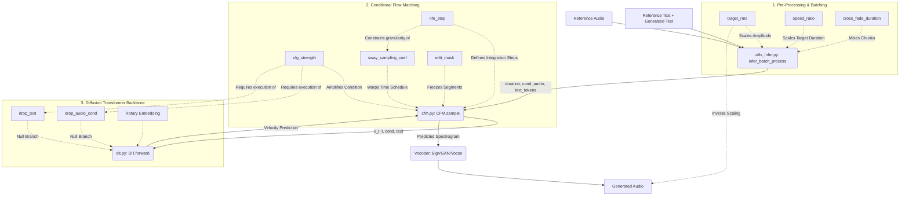

# F5-TTS INFERENCE PIPELINE: DEPENDENCY GRAPH
*(Reverse Engineering Document - No Optimization)*

The following Mermaid graph outlines the data flow and parameter dependencies during the inference execution.

## Graph Analysis
1. **The Pre-Processing Layer** (`target_rms`, `speed_ratio`) runs strictly outside the neural network. Modifying these is mathematically safe and purely deterministic.
2. **The Flow Matching Layer** (`nfe_step`, `cfg_strength`, `sway_sampling_coef`) controls the iterative synthesis loop. Changes here dramatically affect the physical generation dynamics.
3. **The DiT Core** contains static weights and routing booleans. Interventions here (other than CFG routing) risk destroying the pre-trained manifold.
